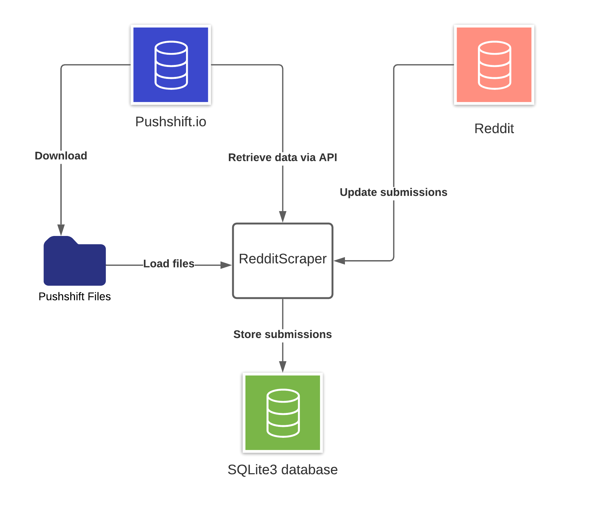

#  Reddit Submission Downloader

# Project contents

## Description

The aim of this repo is to create a database of news posted on *Reddit World News* and their respective date, time and author. Furthermore, the code should be written in such a format that the database of news can easily be updated on a daily basis.

# Architecture



# Install
Clone this directory and install the redditscraper package into your environment.

`pip install .`

# Run

`subredditdownloader [OPTIONS]`

Stop the import by pressing `CRTL+C`. Will cause the import to stop after the next batch.

## Usual Usage
Run this to load submissions from pushshift starting at the latest one in yourdatabase.db.

`subredditdownloader -db yourdatabase.db -r worldnews -ds pushshift --reddit-client-id <YOUR_CLIENT_ID> --reddit-client-secret <YOUR_CLIENT_SECRET> --reddit-username <YOUR_USERNAME> --no-exclude-spam`

You can also pass the secrets using environment variables.

### Options
Get all options with `subredditdownloader --help`.

| Parameter                                        | Values                                  | Description                                                  |
| ------------------------------------------------ | --------------------------------------- | ------------------------------------------------------------ |
| -db / --database-file                            | FilePath                                | Path to the desired sqlite3 database file. Can exist.        |
| -r / --subreddit-name                            | string                                  | Subreddit to download. E.g., "worldnews"                     |
| -ds / --data-source                              | Possibilities: "pushshift", "datafiles" | Switch between the source of the data: pushshift uses the pushshift API, datafiles uses the pushshift provided files from a directory |
| -s / --data-files-directory                      | DirectoryPath                           | Path to the directory where all the desired pushshift files are located. Required if data-source is "datafiles". |
| --after-latest-known/--no-after-latest-known     | bool                                    | Defaults to true. Will respect the current newest entry in the database and only load submissions after it. Setting this to false can cause conflicts with the primary key if the same entry is imported twice. |
| --update-object-reddit/--no-update-object-reddit | bool                                    | Defaults to true. Will update the fetched submission objects with their current version from reddit. This is updates scores and information about the current "removed" status of the content. |
| --reddit-client-id                               | string                                  | Required if update-object-reddit is true. Client-id of the reddit OAuth2 client used. Can be given as environment variable: REDDIT_CLIENT_ID. See here for generation: https://github.com/reddit-archive/reddit/wiki/OAuth2-Quick-Start-Example#first-steps |
| --reddit-client-secret                           | string                                  | Required if update-object-reddit is true. Client-secret of the reddit OAuth2 client used. Can be given as environment variable: REDDIT_CLIENT_SECRET. |
| --reddit-username                                | string                                  | Required if update-object-reddit is true. Username of your reddit account. This is required as per API rules https://github.com/reddit-archive/reddit/wiki/API to be incorporated into the user agent. |
| -l / --limit                                     | int                                     | Limit the amount of submissions to load. Will stop after this many submissions are inserted into the database. Depending on the batch size the actual amount of submissions can be slightly higher. |
| --exclude-removed/--no-exclude-removed           | bool                                    | Defaults to False. If set to True all submissions that have "removed_by_category" set will be excluded. |
| --start-utc                                      | int                                     | UTC timestamp epoch in seconds of when to start ingestion. Overwrites --after-latest-known. |
| --end-utc                                        | int                                     | UTC timestamp epoch in seconds of when to stop. Defaults to -1 day from now(). |

## Load from Pushshift Files

Download your desired timeframe of pushshift reddit submission dumps from here:
https://files.pushshift.io/reddit/submissions/

If a file is present as .xz and .bz2 file prefer the .xz file because of compression. However, it does not matter for the data.
Make sure not to have the same data twice.

```
SELECT author, COUNT(author) AS count FROM submissions WHERE (score > 1) GROUP BY author ORDER BY count DESC;
SELECT domain, COUNT(domain) AS count FROM submissions WHERE (score > 1) GROUP BY domain ORDER BY count DESC;
SELECT COUNT() FROM submissions;
SELECT (score > 1), COUNT(*) FROM submissions GROUP BY (score > 1);
SELECT domain, SUM(score) AS score FROM submissions GROUP BY domain ORDER BY score DESC;
```


